# Entity-Relationship Diagram — New Muslim Companion

This ERD covers the full domain model for the Foundation Package. Tables
marked **(seeded)** have real content shipped in `content/seed/` this phase;
tables marked **(schema only)** exist so the app/backend can grow into them
without a future migration/breaking change, but hold little or no seed data
yet. All tables use an unsigned bigint `id` primary key and `created_at`/
`updated_at` timestamps unless noted otherwise.

```mermaid
erDiagram
  USERS ||--o{ LESSON_PROGRESS : tracks
  USERS ||--o{ QUIZ_ATTEMPTS : attempts
  USERS ||--o{ JOURNAL_ENTRIES : writes
  USERS }o--o{ ROLES : "has (via model_has_roles)"

  ROLES }o--o{ PERMISSIONS : "has (via role_has_permissions)"

  LEARNING_STAGES ||--o{ LESSONS : contains
  LESSONS ||--o{ LESSON_PROGRESS : "progress for"
  LESSONS ||--o{ QUIZZES : "may have"

  QUIZZES ||--o{ QUIZ_QUESTIONS : contains
  QUIZ_QUESTIONS ||--o{ QUIZ_CHOICES : contains
  QUIZZES ||--o{ QUIZ_ATTEMPTS : "attempted via"

  DUA_CATEGORIES ||--o{ DUAS : contains

  SURAHS ||--o{ AYAHS : contains
  AYAHS ||--o{ AYAH_TRANSLATIONS : has
  AYAHS ||--o{ AYAH_TAFSIRS : has
  AYAHS ||--o{ AYAH_WORDS : "word-by-word"

  HADITH_COLLECTIONS ||--o{ HADITHS : contains

  USERS {
    bigint id PK
    string name
    string email UK
    string password
    enum background_type "raised_muslim, revert, exploring, other"
    string locale "default: en"
  }

  ROLES {
    bigint id PK
    string name "admin, scholar_reviewer, content_editor"
  }

  PERMISSIONS {
    bigint id PK
    string name
  }

  LEARNING_STAGES {
    bigint id PK
    string slug UK
    int order
    string title
    text description
    string icon
  }

  LESSONS {
    bigint id PK
    bigint learning_stage_id FK
    string slug UK
    int order
    string title
    text summary
    json body "structured content blocks: heading/text/quote/image-ref"
    int estimated_minutes
    bool is_published
    int version
  }

  LESSON_PROGRESS {
    bigint id PK
    bigint user_id FK
    bigint lesson_id FK
    enum status "not_started, in_progress, completed"
    timestamp completed_at
  }

  QUIZZES {
    bigint id PK
    bigint lesson_id FK "nullable"
    string title
  }

  QUIZ_QUESTIONS {
    bigint id PK
    bigint quiz_id FK
    text question_text
    enum type "mcq, true_false"
    int order
  }

  QUIZ_CHOICES {
    bigint id PK
    bigint quiz_question_id FK
    text choice_text
    bool is_correct
  }

  QUIZ_ATTEMPTS {
    bigint id PK
    bigint user_id FK
    bigint quiz_id FK
    int score
    timestamp completed_at
  }

  DUA_CATEGORIES {
    bigint id PK
    string slug UK
    string title
    string icon
    int order
  }

  DUAS {
    bigint id PK
    bigint dua_category_id FK
    string title
    text arabic_text
    text transliteration
    text translation
    string reference
    string audio_url "nullable"
    bool is_daily_featured
    int order
  }

  SURAHS {
    bigint id PK
    int number UK "1-114"
    string name_arabic
    string name_english
    string name_transliteration
    enum revelation_type "meccan, medinan"
    int ayah_count
  }

  AYAHS {
    bigint id PK
    bigint surah_id FK
    int number_in_surah
    int juz
    int page
    text arabic_text
  }

  AYAH_TRANSLATIONS {
    bigint id PK
    bigint ayah_id FK
    string translator "default: Saheeh International"
    text text
  }

  AYAH_TAFSIRS {
    bigint id PK
    bigint ayah_id FK
    enum source "ibn_kathir, al_sadi"
    text text_summary
  }

  AYAH_WORDS {
    bigint id PK
    bigint ayah_id FK
    int position
    string arabic_word
    string transliteration
    string translation
  }

  HADITH_COLLECTIONS {
    bigint id PK
    string slug UK "nawawi40, bukhari, muslim, riyadh_as_salihin"
    string title
    text description
  }

  HADITHS {
    bigint id PK
    bigint hadith_collection_id FK
    int number_in_collection
    text arabic_text "nullable"
    text english_text
    string narrator
    enum authenticity_grade "sahih, hasan, daif"
    text reference_note
  }

  COMMUNITY_PLACES {
    bigint id PK
    string name
    enum type "mosque, halal_restaurant, halal_shop, islamic_center"
    decimal latitude
    decimal longitude
    string address
    string phone "nullable"
    string website "nullable"
    string osm_id "nullable"
    bool verified
  }

  JOURNAL_ENTRIES {
    bigint id PK
    bigint user_id FK
    date entry_date
    string mood "nullable"
    json prayer_checklist "fajr/dhuhr/asr/maghrib/isha booleans"
    text reflection_text
  }

  NOTIFICATION_TEMPLATES {
    bigint id PK
    enum trigger_type "prayer_time, daily_reminder, streak"
    string title
    text body_template
    bool is_active
  }

  AI_FAQ_ENTRIES {
    bigint id PK
    string canonical_question
    json question_variants
    json keywords
    string category
    text answer_text
    json source_citations
    enum confidence "general_guidance, requires_scholar"
    bool requires_scholar_disclaimer
  }

  CONTENT_VERSIONS {
    bigint id PK
    string content_type
    int version
    string checksum
    timestamp published_at
  }
```

## Table status this phase

| Table | Status |
|---|---|
| `users`, `roles`, `permissions` (+ pivot tables) | **Implemented** — spatie/laravel-permission standard tables, published via Laravel's vendor:publish |
| `learning_stages`, `lessons`, `lesson_progress` | **Implemented + seeded** (4 Stage 1 lessons) |
| `quizzes`, `quiz_questions`, `quiz_choices`, `quiz_attempts` | **Schema only** — migrations exist, no seed data or endpoints yet |
| `dua_categories`, `duas` | **Implemented + seeded** (~5 duas) |
| `surahs`, `ayahs`, `ayah_translations`, `ayah_tafsirs`, `ayah_words` | **Implemented + seeded** (Al-Fatihah, Al-Ikhlas; word-by-word only for Al-Fatihah ayah 1) |
| `hadith_collections`, `hadiths` | **Implemented + seeded** (3 hadiths from An-Nawawi's 40) |
| `community_places` | **Schema only** — no live OSM/Overpass integration yet |
| `journal_entries` | **Schema only** — no client UI yet |
| `notification_templates` | **Schema only** — no push scheduling implemented |
| `ai_faq_entries` | **Implemented + seeded** (8-12 entries), mirrored on-device in Drift |
| `content_versions` | **Schema + stub endpoint only** — full sync engine is future work |
