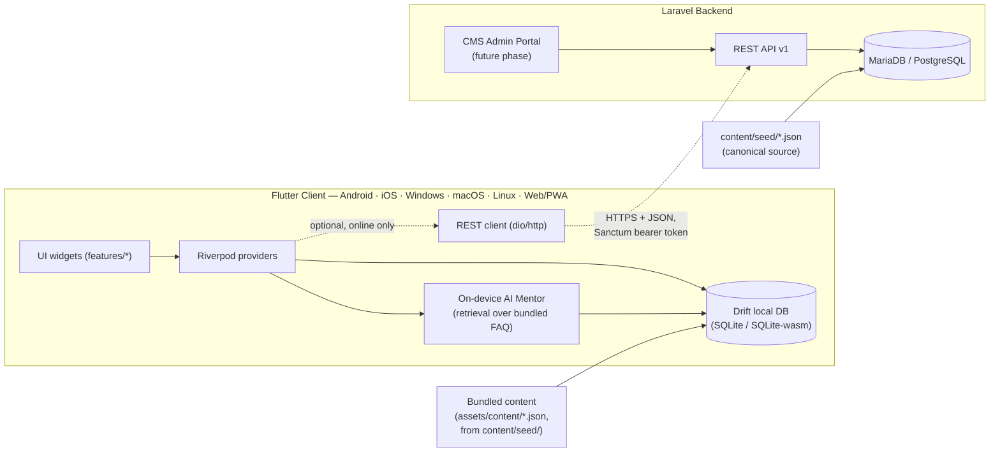

# System Architecture — New Muslim Companion

## Guiding principle: offline-first, sync-optional

The Flutter client is a fully self-contained application. On first launch it
imports a bundled content package (JSON seed content — lessons, duas, Quran
text, Hadith, AI mentor FAQ) into a local Drift (SQLite) database. Every core
feature — learning journey, prayer times, dua library, Quran, Hadith, journal,
AI mentor — reads and writes to this local database and works with **zero
network connectivity**, indefinitely.

A Laravel REST API exists as an **optional layer**: creating an account and
enabling sync lets progress, journal entries and quiz results be backed up
and restored across devices. Nothing in the core learning experience requires
an account or a network connection. Location-based features (finding nearby
mosques/halal shops) and content updates are the only features that need
connectivity by nature, and both degrade gracefully offline.

## Component diagram

## Layers

### 1. Content layer (`content/`)

`content/seed/**/*.json` is the single canonical source of truth for all
Islamic content shipped in this phase (learning stages/lessons, dua library,
Quran surahs/ayahs, Hadith, AI mentor FAQ). It is consumed two ways:

- **Backend**: Laravel database seeders read these files directly (Laravel
  lives at the repo root and `content/` is a sibling directory) and load
  them into the relational schema described in [`er-diagram.md`](er-diagram.md).
- **Client**: `scripts/sync-content.ps1` / `.sh` copies the same JSON files
  into `frontend/assets/content/` so they can be declared as Flutter assets
  and bundled into every platform build. On first app launch, `SeedImporter`
  imports them into the local Drift database.

This means the schema the backend seeds and the schema the client imports are
defined by the same files — there is one content model, not two that could
drift apart.

### 2. Client layer (`frontend/`)

Flutter app, single codebase for all six targets. See
[`../design-system/design-tokens.md`](../design-system/design-tokens.md) for
the visual design system and the Flutter README/dev-setup guide for package
choices (Riverpod, Drift, go_router, adhan_dart). The client is the
system's source of truth for a given device's state while offline; sync (when
enabled) reconciles it with the server.

### 3. Server layer (repo root)

Laravel 13 REST API, living at the **repo root** (not a subfolder) so that
Forge's default deployment flow — which runs `composer install` at the
release root — works with no custom path configuration. Authentication via
Laravel Sanctum (bearer tokens — not
cookie/session auth — so the same auth flow works identically across mobile,
desktop and web clients). Role-based access (`spatie/laravel-permission`) for
the future CMS/admin portal, where scholars and administrators will manage
content, review analytics, and manage the mosque/halal directories.

In this phase the API implements: auth (register/login/logout/me),
learning-stage and lesson read endpoints, and a deterministic "today's dua"
endpoint. All other domain endpoints (Quran, Hadith, community directory,
journal, content-version manifest, full CMS CRUD) are specified in
[`../api/openapi.yaml`](../api/openapi.yaml) tagged `x-status: planned` —
the contract exists so client and server work stays consistent as those are
built out, but no controller code exists for them yet.

### 4. Sync layer (future work)

[`content-sync-and-versioning.md`](content-sync-and-versioning.md) documents
the intended design for delta content updates and account-based progress
sync. Only a `content_versions` table + `GET /api/v1/content/manifest` stub
exists in this phase; the actual sync engine, conflict resolution, and
background download manager are not implemented yet.

## Directory-to-layer map

| Directory | Layer |
|---|---|
| `content/` | Canonical content, shared by both layers |
| repo root (`app/`, `routes/`, `config/`, etc.) | Server (Laravel API) |
| `frontend/` | Client (Flutter) |
| `docs/` | Cross-cutting documentation |
| `scripts/` | Dev tooling gluing content/ to frontend/ |
